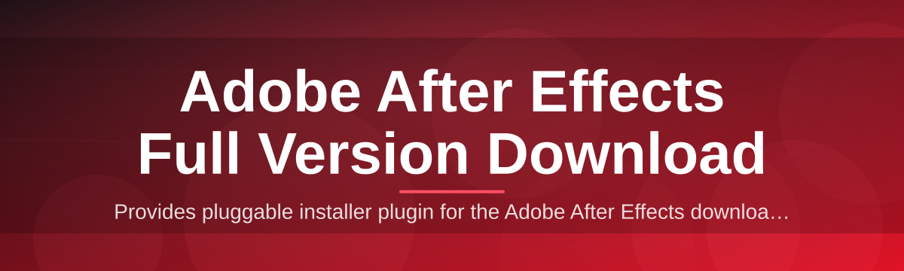
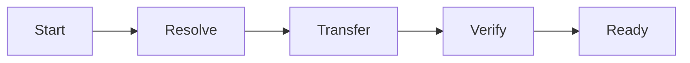

# adobe-after-effects-full-manager 🎬✨

  

*A weekend-built companion that streamlines your Adobe After Effects full version download and keeps your motion-graphics rig tidy.*

## 📖 Overview

So here's the origin story: this whole thing started because I was tired of juggling a dozen browser tabs, redirect pages, and half-broken mirrors every time I needed to get a fresh copy of After Effects onto a new editing rig. What began as a scrappy personal script to organize an Adobe After Effects full version download folder slowly turned into a full-blown manager — one that tracks builds, checks integrity, and gives you a clean interface instead of a pile of loose installer files scattered across your Downloads folder.

**adobe-after-effects-full-manager** is a lightweight Windows companion app built for editors, motion designers, VFX hobbyists, and studio technicians who need a predictable, repeatable way to fetch and organize After Effects builds across machines. It doesn't try to reinvent Adobe's own tooling — instead it wraps the messy parts (versioning, verification, local caching, launch shortcuts) into something that feels like a proper desktop utility rather than a random zip file you found somewhere.

Whether you're setting up a single freelance workstation or provisioning a small render farm for a client project, this tool aims to make the whole After Effects full version download experience feel less like archaeology and more like clicking one button and getting on with your actual creative work.

> [!NOTE]
> This is an independent, community-maintained utility. It is not affiliated with or endorsed by Adobe Inc. Adobe After Effects is a trademark of Adobe Inc.

  

---

<h2>🚀 What This Thing Actually Does</h2>

I wanted every feature here to earn its place — no filler, no fluff. Here's what you get:

- **One-click retrieval flow** — the app coordinates the entire Adobe After Effects full version download sequence from a single dashboard, so you're not bouncing between five different pages.

- **Build fingerprinting** — every package gets checksummed on arrival so you always know exactly what version and build number landed on your disk.

- **Local version shelf** — think of it as a bookshelf for installers. Old builds don't vanish; they sit neatly labeled until you decide to clear them out.

- **Resume-aware transfers** — spotty campus Wi-Fi or a flaky hotel connection won't force you to start the download from zero again.

- **Silent-mode fetching** — minimize the window, keep working in Premiere or Illustrator, and let the manager grind away in the background.

- **Portable config profiles** — export your setup preferences as a small file and carry them to your next machine in seconds.

- **Launch shortcuts hub** — pin your favorite build straight to the taskbar without digging through folders every time.

- **Bandwidth throttle slider** — because nobody wants the download manager eating the whole office router during a client call.

  

> [!TIP]
> If you manage more than one editing workstation, export your profile once and reuse it — it saves a surprising amount of setup time when reinstalling After Effects on a fresh Windows image.

<h2>🧭 Getting Off the Ground</h2>

No installers-within-installers, no dependency chains. Here's the whole ritual:

1. **Visit the landing page** using the download button above — that's the only place this project's builds live.

2. **Grab the latest build** for Windows; the page always points to the current release.

3. **Run the executable** — it's a standalone binary, so there's nothing else to unpack or configure first.

4. **Pick your After Effects channel** inside the app (current release, previous stable, or beta track) and let the manager handle the rest of the Adobe After Effects full version download process.

> [!IMPORTANT]
> Always download from the official landing page linked in this README. Mirrors and reposted links floating around forums are not maintained by this project and may not match the checksums shown in-app.

<h2>🖥️ What Your Machine Needs</h2>

| Requirement | Minimum | Comfortable |
|---|---|---|
| OS | Windows 10 (64-bit) | Windows 11 |
| RAM | 4 GB | 8 GB+ |
| Disk space | 6 GB free | 15 GB+ free |
| Dependencies | None | None |
| Internet | Required for fetching builds | Broadband recommended |

- Fully **standalone** — no runtime installers, no bundled frameworks to babysit.
- No dependency soup — it runs the moment you double-click it.
- Works fine on a modest laptop; the app itself is light, even though the After Effects build it fetches is not.

<h2>⚙️ How It Actually Works Under the Hood</h2>

The architecture is intentionally simple — five moving parts, no magic:

1. **Request stage** — you pick a build inside the UI.
2. **Resolve stage** — the manager resolves the correct package reference from the landing page.
3. **Transfer stage** — the file streams down with resume support and live checksum tracking.
4. **Verify stage** — integrity gets confirmed before anything is marked "ready."
5. **Ready stage** — the build lands in your local shelf, ready to launch.

> [!NOTE]
> Verification happens automatically every time — there's no manual "trust me" step, which is the whole point of having a manager instead of a bare download link.

<h2>🧩 Troubleshooting Corner</h2>

**Q: My Adobe After Effects full version download stalled at 80% and won't move.**
A: Check the bandwidth throttle slider in Settings — a low cap combined with a slow connection can look like a stall. Nudge it up or switch to unmetered Wi-Fi.

**Q: The app says "checksum mismatch" — should I be worried?**
A: Not really, but don't launch that build. Delete it from the shelf and re-fetch; it usually means the transfer was interrupted mid-write.

**Q: After Effects launches but crashes immediately after install.**
A: This is almost always a GPU driver issue, not a manager issue. Update your graphics drivers before reinstalling the build.

**Q: Can I run this on macOS?**
A: Not currently — the manager is Windows-only for now. There's a community thread discussing a future build for other platforms.

**Q: The landing page button isn't loading for me.**
A: Try a different browser or disable aggressive ad-blockers temporarily; some extensions misidentify legitimate download pages.

**Q: My antivirus flagged the executable.**
A: Standalone downloader tools sometimes trip heuristic scanners. Verify the build's checksum against what's shown on the landing page before proceeding.

<h2>🎨 The Look and Feel</h2>

- **Dark and light themes** — toggle from the tray icon, no restart needed.
- **Keyboard-first navigation** — `Ctrl+D` starts a download, `Ctrl+Shift+V` triggers a manual verify, `Esc` minimizes to tray.
- **Compact mode** — shrink the window into a slim progress bar for multitaskers.
- **Custom accent colors** — because staring at gray progress bars all day is nobody's idea of fun.

Full shortcut list

| Shortcut | Action |
|---|---|
| `Ctrl+D` | Start download |
| `Ctrl+Shift+V` | Manual verify |
| `Ctrl+L` | Open local shelf |
| `Ctrl+,` | Open settings |
| `Esc` | Minimize to tray |

<h2>🤝 Contributing & Community</h2>

This started as a solo weekend project, but it's grown a genuinely lovely little community around it. Contributions, bug reports, and feature ideas are always welcome.

- Open an issue if something feels off with the manager's behavior.
- Submit a pull request if you've fixed something or polished the UI.
- Share your workflow tips — a lot of the best features here started as user suggestions.

> [!WARNING]
> Please don't use issues to request or share unofficial installer links. Keep discussion focused on the manager itself.

<h2>📄 License</h2>

This project is released under the [MIT License](LICENSE), 2026. Use it, fork it, remix it — just keep the license notice intact.

<h2>⚠️ Disclaimer</h2>

This repository provides a management utility that assists with an Adobe After Effects full version download workflow. It does not host, redistribute, or modify Adobe's software. Adobe After Effects is the property of Adobe Inc., and all trademarks belong to their respective owners. Use this tool in accordance with Adobe's own licensing terms.

---

  

